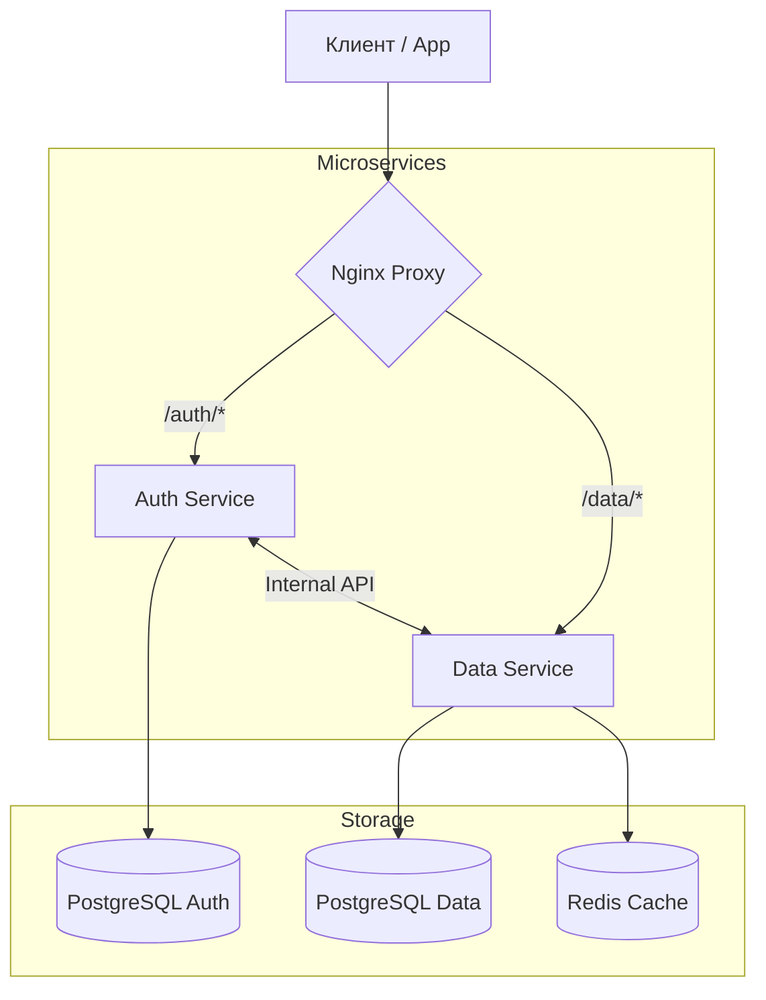

# Dart Backend Stepik: Исходный код курса 🚀

Добро пожаловать в репозиторий с исходным кодом курса **"Разработка Backend на Dart"**. Этот проект демонстрирует создание современной микросервисной архитектуры с использованием языка Dart и фреймворка Shelf.

## 📌 О проекте

👉 **[Перейти к курсу на Stepik](https://stepik.org/a/119593)**

Проект представляет собой бэкенд для платформы блогов/социальной сети, разделенный на два основных микросервиса: **Auth** (управление пользователями и сессиями) и **Data** (управление постами).

### Основные возможности:
- **Микросервисная архитектура**: Разделение ответственности и независимое масштабирование.
- **JWT Аутентификация**: Использование Access и Refresh токенов для безопасности.
- **Type-safe ORM**: Работа с базой данных через Drift.
- **Кэширование**: Использование Redis для оптимизации запросов в сервисе данных.
- **Reverse Proxy**: Nginx как единая точка входа.
- **Контейнеризация**: Полная поддержка Docker и Docker Compose.

---

## 🛠 Технологический стек

- **Язык**: [Dart](https://dart.dev/) (3.10+)
- **Веб-фреймворк**: [Shelf](https://pub.dev/packages/shelf) + [Shelf Router](https://pub.dev/packages/shelf_router)
- **База данных**: [PostgreSQL](https://www.postgresql.org/)
- **ORM**: [Drift](https://drift.simonbinder.eu/)
- **Кэширование**: [Redis](https://redis.io/)
- **Инфраструктура**: [Docker](https://www.docker.com/), [Nginx](https://www.nginx.com/)

---

## 📐 Архитектура проекта



### Сервисы:
1.  **Auth Service (Port 9000)**:
    - Регистрация и вход пользователей.
    - Выдача и обновление JWT токенов.
    - Управление данными профиля.
2.  **Data Service (Port 9004)**:
    - Создание, удаление и получение постов.
    - Интеграция с Redis для кэширования.
    - Обработка межсервисных запросов (например, удаление постов пользователя при его удалении).

---

## 🚀 Быстрый запуск

### Предварительные требования
Убедитесь, что у вас установлены:
- [Docker](https://www.docker.com/get-started)
- [Docker Compose](https://docs.docker.com/compose/install/)

### Шаги запуска

1. **Клонируйте репозиторий**:
   ```bash
   git clone <repository_url>
   cd dart_backend_stepik
   ```

2. **Настройте переменные окружения**:
   Скопируйте пример `.env` файла и заполните его своими данными:
   ```bash
   cp .env.example .env
   ```

3. **Запустите проект**:
   ```bash
   docker-compose up -d --build
   ```

После запуска API будет доступно по адресу: `http://localhost`.

---

## ⚙️ Конфигурация (.env)

| Переменная | Описание |
| :--- | :--- |
| `DB_NAME`, `DB_USER`, `DB_PASSWORD` | Данные для подключения к базе Auth |
| `DATA_DB_NAME`, `DATA_DB_USER`, `DATA_DB_PASSWORD` | Данные для подключения к базе Data |
| `JWT_SECRET` | Секретный ключ для подписи токенов |
| `SALT` | Соль для хэширования паролей |
| `INTERNAL_SECRET` | Ключ для взаимодействия между сервисами |
| `REDIS_HOST`, `REDIS_PORT` | Настройки подключения к Redis |

---

## 📚 О курсе

Этот код является частью обучающего курса на Stepik. В нем подробно разбирается каждый этап создания данной системы: от настройки окружения до деплоя.

👉 **[Перейти к курсу на Stepik](https://stepik.org/a/119593)**

---
*Разработано в рамках курса "Dart Backend" на Stepik.*
